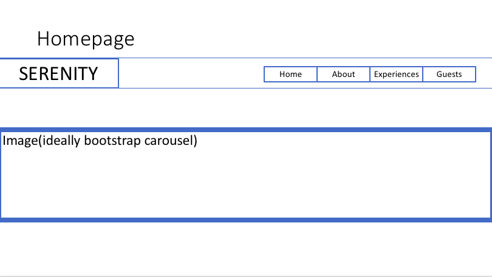
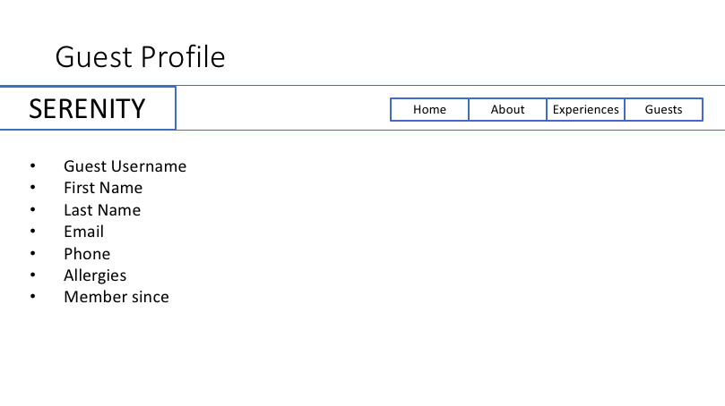
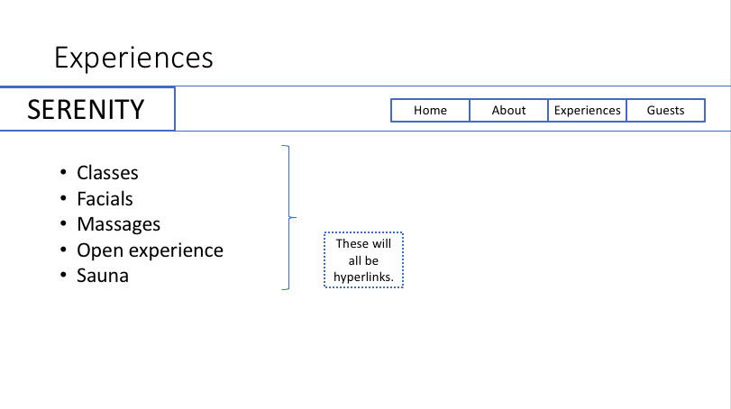
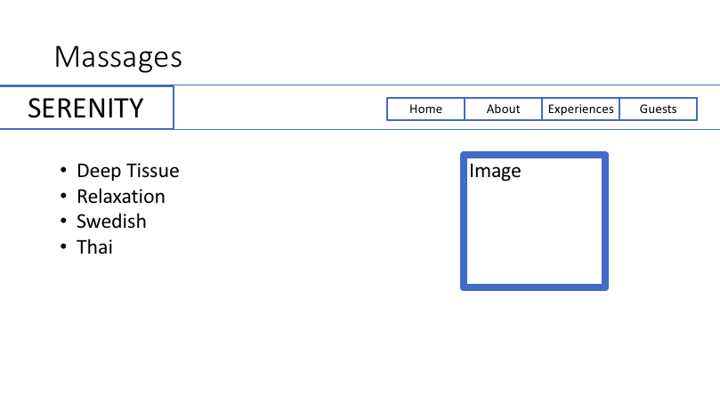
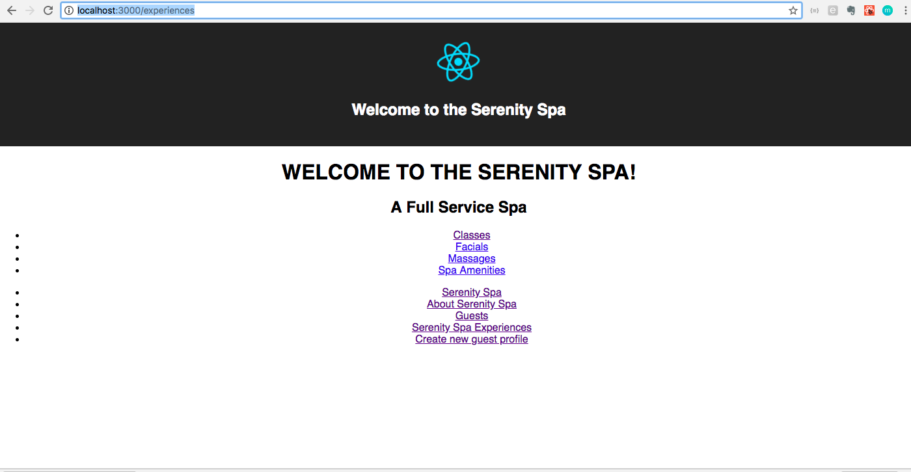
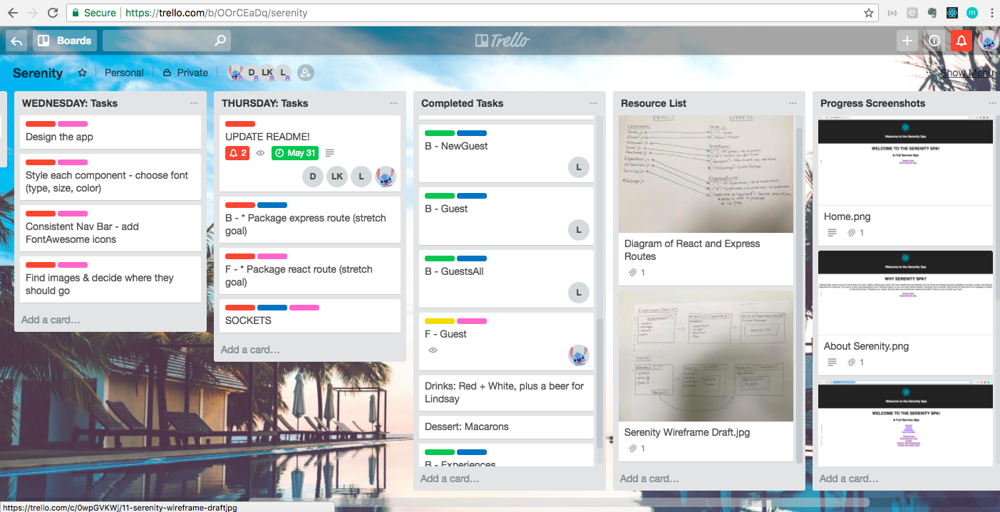
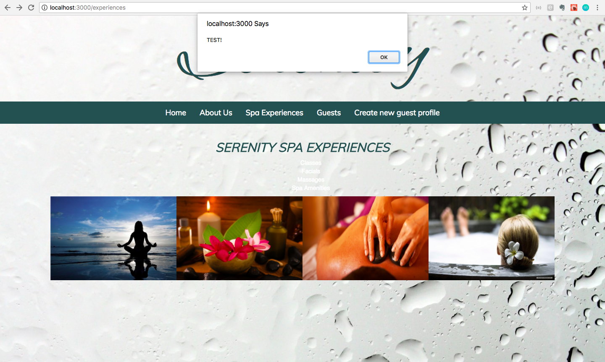
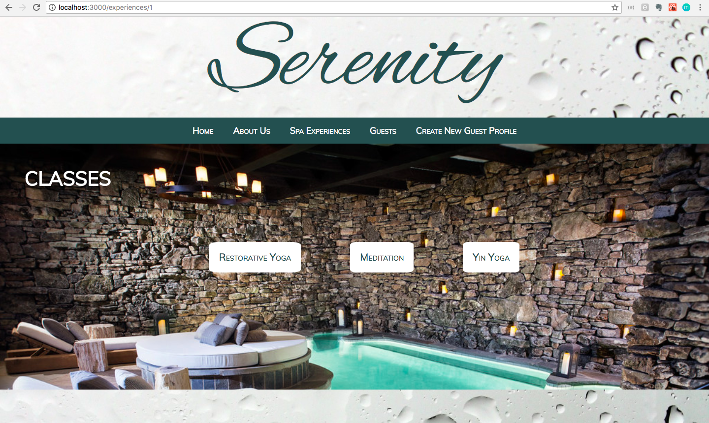

# Project 3 - SPA with React and Express
(Dani Espinoza, Stephanie Glover, Lilli Ku, Lindsay Pforsich)

## Proposal

### Introduction

**Serenity**

Our team app is a Spa SPA. Users (or “Guests”) will be able to visit our site and view: our homepage, about section, experiences available, and services offered. Additionally, guests may create profiles and plan a day at the spa by adding experiences/services to their “day package.”

### Technologies
* For frontend we will use: Javascript with React, CSS (including Bootstrap and FontAwesome), and HTML5.
* For backend we will use: Express, Node.js, & PostgreSQL.
* We plan to organize all directories, routes, etc. prior to beginning our project. We will also design our database and specify all columns in our tables before beginning our development. This will help us avoid any difficulty with route confusion and will keep our code DRY.

### MVP
Be able to create, read, update, and delete a guest profile, and have two related database tables.

### Goals
* Pull info from tables in our database to show information for: guests, experiences, and services.
* Style app in consistent manner.
* Create an “About Us” component.

### Stretch Goals
* Pull info from tables in our database to show guest page and day package selections.
* Add Sockets to talk to a Spa representative.

### Timeline
* By **Friday**: Have all app framework complete and branch from master. Database will be built with all tables and data seeded.
* By **Tuesday**: All routes built on frontend and backend.
* By **Wednesday**: Style entire app.
* By **Thursday**: Stretch goals, if possible. Update READ.ME.

### Wireframes
* Homepage

* Guest page

* Experiences page

* Service page

### Struggles
* Splitting up the work so that there were minimal code conflicts
* Adding a cross table so that on a button click, a guest could add a spa service to their guest package
* Removing an item from a page without refreshing the page, so that the app would remain a SPA
* Creating a consistent style that all 4 group members agreed with
* Using a data value to search/retrieve data from a separate table
* Group Git: Rebasing before git push and coordinating merges

### App
* https://blooming-savannah-13464.herokuapp.com/

### Future Goals
* With more time, we would add sockets so that a guest could chat with a spa representative
* We would add guest authentication, rather than displaying a list of guests
* Additional styling
* Alphabetize the guests
